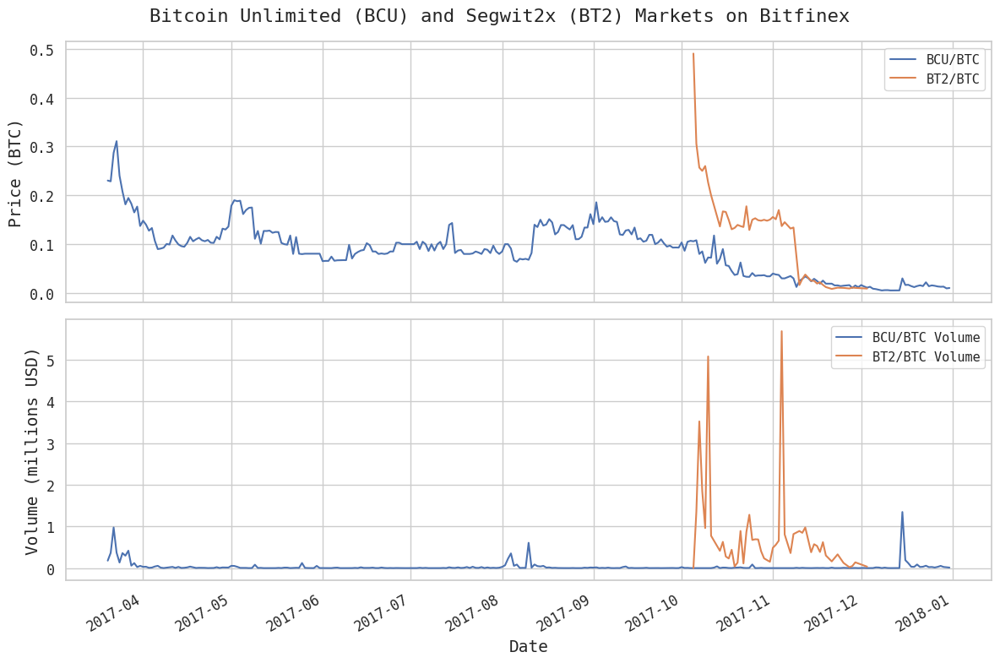
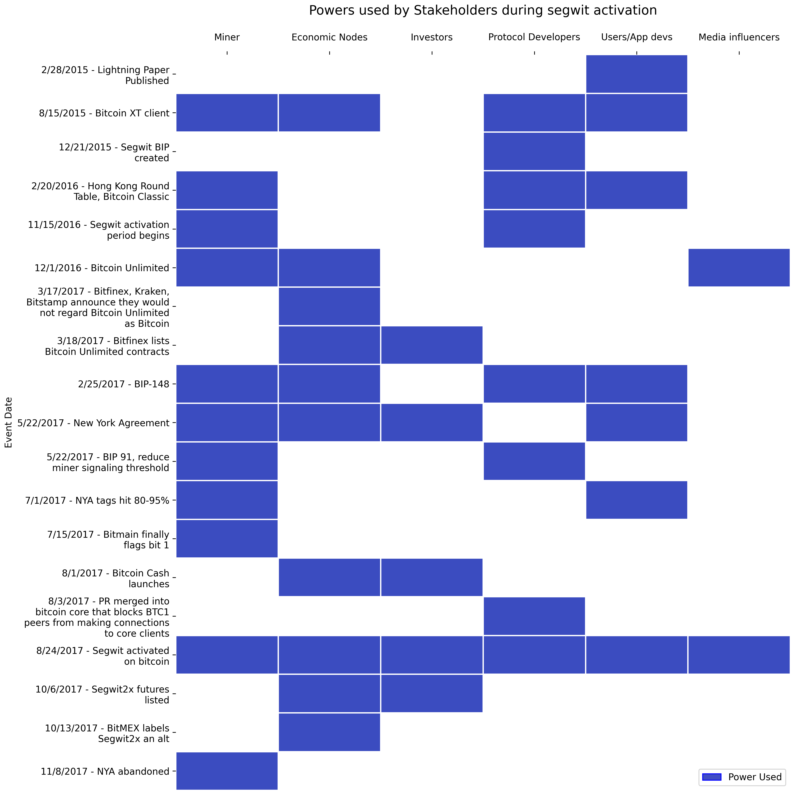
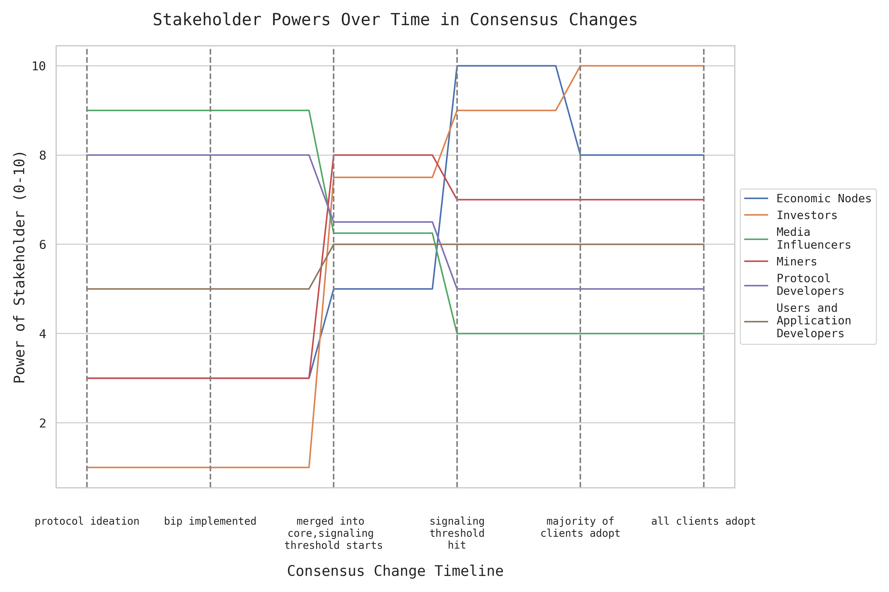
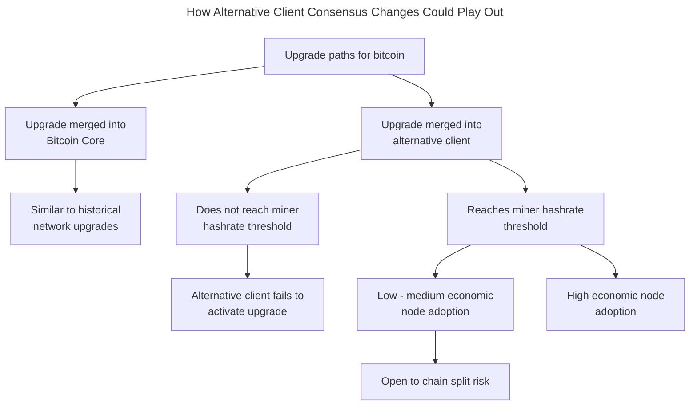
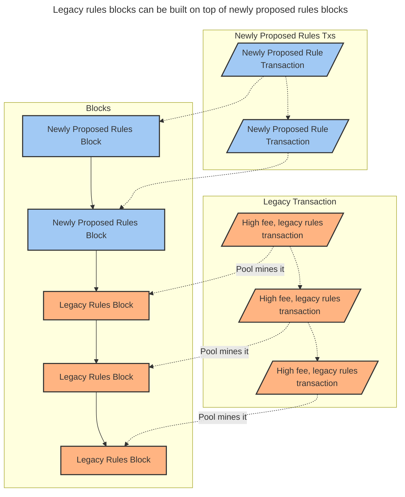
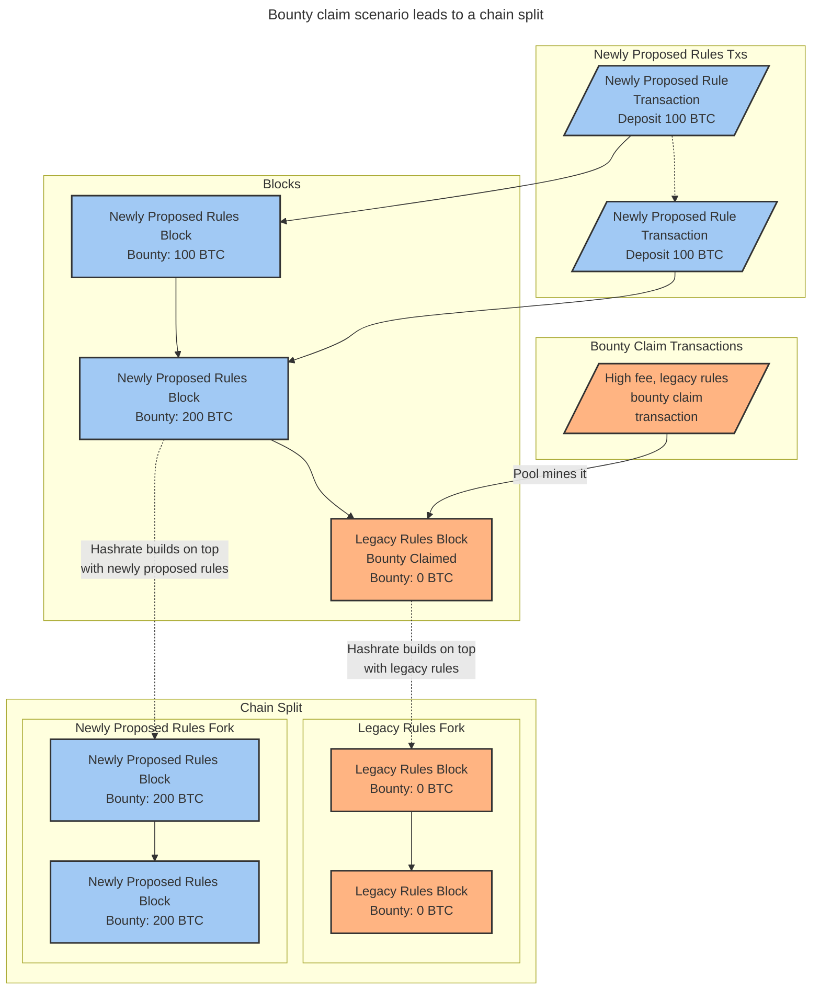

# Analyzing Bitcoin Consensus: Risks in Protocol Upgrades

Original Authors (V1): Ren Crypto Fish, Steve Lee, Lyn Alden

Thank you to the following people who reviewed drafts of the initial project, providing valuable feedback to improve the quality of the project:

Mat Balez, Jay Beddict, Jeff Booth, Joe Carlasare, Hong Fang, David Harding, Avichal Garg, Gwart, Chaitanya Jain, Shirish Jajodia, Hong Kim, David King, Jameson Lopp, Shehzan Maredia, Sanjay Mavinkurve, Murch, Matt Odell, John Pfeffer, Reardencode, Bradley Rettler, Rijndael, Pierre Rochard, AJ Towns, 0xkrane, jesmros

# Table of contents

[Introduction](#Introduction)

[What is Bitcoin Consensus](#What-is-Bitcoin-Consensus)

[What maintains Bitcoin Consensus](#What-maintains-Bitcoin-Consensus)

[Recommendations](#Recommendations)

# Introduction

This paper provides an analysis of bitcoin’s consensus mechanism, focusing on the roles of various stakeholders, their powers, and the incentives that guide their actions. Bitcoin is incredibly difficult to change by design. The default is no change. Any significant change needs to pass that hurdle. We categorize the roles people play in bitcoin's consensus into [six distinct stakeholder groups](#stakeholders), each with their own motivations and influence. We also notice that the relative powers of the stakeholders shift depending on their role in the network’s operation and the stage of the consensus change process. Notably, while [Bitcoin Core maintainers](#protocol-developers) do not have excessive power to change Bitcoin, they possess significant power to veto changes. We also introduce the concept of [State of Mind](#state-of-mind), which affects the degree that stakeholders engage in the process of finding consensus.

Historically, changes to Bitcoin's consensus have typically followed a smooth path. However, it is essential to thoroughly explore and understand potential future scenarios that may be more contentious and could lead to a fragile network. This paper presents [a novel analysis](#consensus-changes-with-alternative-clients) of the challenges and risks associated with adopting alternative clients. Although alternative clients are an important option, their adoption is difficult to achieve. Soft fork consensus changes can be partially deployed without full consensus, creating a fragile network prone to forks with [uncertain outcomes](#upgrade-paths-with-alternative-consensus-clients). During a soft fork, investors also have less power than other stakeholders. We highlight the [risks of bounty claims](#how-might-this-occur-with-a-soft-fork) in contentious consensus change scenarios involving alternative clients, which increase chain split risks.

In the event of a hard fork, we observe that [not all Investors are equal](#what-happens-after-a-chain-split) when it comes to price discovery. Large investor segments may react more slowly, if at all, compared to nimble, self-custodying Investors. Since many Investors do not run nodes themselves, their influence is diminished until a chain split occurs or a futures market develops. Additionally, a stakeholder’s awareness and engagement impact their influence on bitcoin’s consensus; possessing power is ineffective if one is unaware or apathetic.

By examining [past consensus upgrades](#segwit) and [future scenarios](#future-scenarios-and-considerations), taking into account the game theory surrounding stakeholder involvement — we aim to enhance understanding of how bitcoin’s consensus is maintained, how it can be changed, and the risks associated with protocol upgrades. Our goal is to equip stakeholders with the tools and frameworks needed to assess and contribute to the evolution of bitcoin’s consensus effectively. We offer [recommendations](#recommendations) for stakeholders on evaluating proposed changes, including identifying proposals that are maturing toward consensus, asking critical questions about their benefits and potential risks, and determining whether a change has broad support.

# What is Bitcoin Consensus

Bitcoin consensus refers to the set of rules that define the validity of transactions and blocks. These rules are encoded in software run by and enforced by the network’s nodes, ensuring that all participants agree on the blockchain’s transaction history.

## Technical Aspects of Consensus

Important aspects of bitcoin’s technical consensus include:

1. Block Validation: Define what constitutes a valid block, including aspects like block size, block header, transaction structure, and proof-of-work requirements.
2. Transaction Validation: How transactions should be structured and what makes them valid, including rules about inputs and outputs, signatures, and script execution.
3. Chain Selection: Determine which chain is considered the canonical bitcoin blockchain in case of forks, typically based on the valid chain with the most accumulated proof-of-work.

Understanding the technical aspects of consensus is important because any changes to the client software that change these technical aspects of consensus result in either a soft fork or hard fork (described in greater depth below) and the nodes on the network may be required to upgrade and adopt newer versions of the client. For example, new opcodes introduced require a soft fork or hard fork because they affect script execution, making scripts that completed successfully before the fork now terminate in failure (in the case of a soft fork), or vice versa (in the case of a hard fork).

## How are changes activated

### Soft Forks vs Hard Forks

Soft forks and hard forks are two types of protocol changes in blockchain networks like bitcoin. Soft forks are backwards-compatible upgrades where old nodes still see new blocks as valid, though they may miss out on new features. They only tighten or add rules to the existing protocol and can be activated with consensus from the network. Furthermore, for soft forks, only the nodes that want to use the newly proposed rules have to upgrade. Soft forks are generally preferred in bitcoin due to being a more pragmatic coordination solution as the window of time for Economic Nodes to upgrade can be quite lengthy. Examples include segwit and P2SH. However, they can create two classes of nodes, upgraded and non-upgraded nodes. The median time for a bitcoin node to upgrade has historically been ~40 weeks, but that has been trending even longer in recent years.

 [^1]

Hard forks, on the other hand, are non-backwards-compatible upgrades requiring all nodes to upgrade within an activation window of time with code that activates at the same block height to maintain consensus. They can change or relax existing rules, allowing for more extensive protocol modifications. Hard forks need near-universal consensus to avoid permanent chain splits and are more difficult to coordinate. Hard forks do not necessarily create a separate chain if all existing nodes on the network use the hard fork or if Miners do not continue mining the previous rule set. For example, the addition of OP_NOP in 2010 was done with a hard fork on bitcoin. While they can fix fundamental issues or add significant new features, they carry a higher risk of community divisions and network splits. Notable examples include the Bitcoin Cash hard fork in 2017, where a proposal to increase the block size limit led to disagreements within the Bitcoin community, resulting in a contentious hard fork and the creation of a new coin. This illustrates the risks of chain splits and network fragmentation inherent in hard forks.

### Historical Activation Mechanisms

Activation mechanisms refer to the processes through which upgrades are rolled out on the bitcoin network. As bitcoin has grown, so too have the number of stakeholders and the complexity of coordinating network-wide upgrades. The activation mechanisms themselves have evolved to address these growing challenges, each offering distinct trade-offs in terms of security, flexibility, and consensus-building. Below, we explore the key activation mechanisms that have been used historically.

#### Flag Day

A Flag Day activation is one of the earliest and simplest methods used for upgrading the bitcoin network. It involves setting a specific future date or block height at which the new rules automatically come into effect. This method does not rely on any form of signaling; instead, it mandates that all nodes must be upgraded by a certain point in time.

Advantages:

- Simplicity: Easy to implement and understand, with a clear deadline for all participants.
- Predictability: Ensures a fixed timeline for the upgrade, reducing uncertainty about when the change will occur.

Risks and Considerations:

- Risk of Chain Splits: If a significant portion of the network fails to upgrade by the Flag Day, it can lead to the creation of incompatible chains.
- Lack of Flexibility: There is no built-in mechanism to gauge network readiness or adjust the timeline, which can force through an upgrade even if consensus is not fully achieved.

Early proposals such as BIP16 Pay to Script Hash (P2SH) used a predetermined Flag Day to activate on the network.[^2] P2SH was activated on April 1, 2012 at block 173,805. Following the activation there were reports that some Miners who failed to update from 0.6.0 rc1 were stuck at block 170,060.[^3]

#### BIP34 and BIP9

BIP34 introduced an upgrade path for versioned transactions and blocks. Miners would increment their version number in the block header to activate the upgrade. Once 75% of the last 1000 blocks had the upgraded version 2 number, invalid version 2 blocks were rejected. Once 95% of the last 1000 blocks were version 2 or greater, all version 1 blocks would be rejected. This mechanism would allow the network to more gradually upgrade. CheckLockTimeVerify (BIP65) and Strict DER Signatures (BIP66) were successfully activated with BIP34. The activations with BIP34 at the time had short grace periods for nodes on the network to upgrade.

BIP9 followed BIP34 and introduced the ability for Miners to signal readiness for multiple upgrades with version bits in the block header. Similar to BIP34, upgrades on the network would only lock in and activate if a certain hashrate threshold is reached before nodes begin enforcing the new rules, often with a long grace period that allows nodes on the network to upgrade. If the threshold was not reached, then the activation would not occur.

CheckSequenceVerify (BIP68, BIP112, BIP113) was activated successfully with version bits signaling at a 95% threshold with a 2 week grace period after the hashrate threshold was reached for nodes on the network to upgrade.

Segwit (BIP141, BIP143, BIP147) was also activated successfully with version bits signaling with a 95% threshold, but it highlighted some of the risks with miner activated soft forks.

Advantages:

- Flexibility: Can handle multiple upgrades simultaneously.
- Miner coordination: Allows Miners to signal readiness.
- Grace period: Provides time for the network to prepare after the signaling threshold is met.
- Speed: Allows for faster deployments, a principled approach to a flag day would require the flag day to be set much longer in the future to minimize disruption.

Risks and Considerations:

- Potential for miner veto and stalling: If Miners do not signal, the upgrade cannot activate.
- Complexity: More complex to implement and understand than flag day.
- Potential for false signaling: Miners could signal readiness without actually upgrading their software, creating risk of chain reorgs and network disruption.
- Lack of user input: The mechanism does not directly account for the preferences of non-mining full nodes and other network participants.

The experiences with BIP34 and BIP9 activations, particularly the challenges faced during the segwit activation, led to further refinements in activation mechanisms. These lessons influenced the development of subsequent proposals like BIP8 and the concept of User Activated Soft Forks (UASF), which aim to address some of the limitations of purely miner-driven activation processes.

#### User Activated Soft Forks (BIP8) and User Resisted Soft Forks

BIP8 was proposed as an evolution of BIP9, addressing some of its limitations, particularly the potential for miner-driven activation vetoes. Although largely similar to BIP9, BIP8 includes a crucial option to set "lockinontimeout" (LOT) to True, in which case blocks are required to signal in the final period, ensuring the soft fork has locked in by the timeout height.

Advantages:

- Prevents Miner Veto: With LOT=true, Miners cannot indefinitely block an upgrade.
- Flexibility: Can be configured to behave like BIP9 (with LOT=false) or to guarantee activation (with LOT=true).

Risks and Considerations:

- Potential for Chain Splits: If there is significant disagreement, especially with LOT=true, it could lead to a chain split.
- Likely Chain Reorgs: The required signaling approach at the end of the period guarantees that, if the BIP8 specific logic is reached, unupgraded nodes are exposed to chain reorgs, potentially losing funds due to double-spends.
- Complexity: Requires careful coordination and communication to ensure network-wide understanding and readiness.
- Pressure on Miners: LOT=true could be seen as coercive towards Miners, potentially creating tension in the ecosystem.

Although BIP8 has never been implemented as an activation mechanism in Bitcoin Core, versions of User Activated Soft Forks (UASF) have been implemented in an alternative client such as for activation of segwit and taproot. There is substantial debate over the value of BIP8.

The mirror of a User Activated Soft Fork is a User Resisted Soft Fork (URSF). In a UASF, blocks that do not signal for a soft fork are rejected, in a URSF, blocks that do signal for a soft fork are rejected. As the miner signaling threshold approaches, the URSF will reject the last block prior to the signaling threshold being hit and cause a chain split.[^4] The concept of URSF first arose surrounding discussions of BIP-119 (CTV).[^5]

# What maintains Bitcoin Consensus

In bitcoin, each major stakeholder group possesses certain powers and is driven by a set of incentives that shape how they are likely to wield those powers. Entities may belong to multiple stakeholder groups, leading them to exercise various powers and navigate a mix of potentially competing incentives. For instance, a wealthy investor might also be a large influencer, or a business could operate an Economic Node, engage in mining, employ Protocol Developers, and have media influence. Additionally, entities can sometimes act against their typical group incentives for ideological or other reasons, meaning incentive descriptions apply to the average group, but allow for individual variance. When assessing whether groups should be classified together or separately in terms of their impact on consensus, it is important to consider whether their incentives and powers are meaningfully similar. If both aspects align, they can be treated as the same group for consensus purposes; if they differ, they should be regarded as distinct.

## State of Mind

There are different states of minds (SOM) the different stakeholders might be in towards a given proposal for a protocol change that affects the degree that stakeholders engage in the process of finding consensus.

1. SOM1: Passionate advocate for a change
2. SOM2: Supportive of a change
3. SOM3: Apathetic or undecided
4. SOM4: Unaware
5. SOM5: Not supportive, but not to a degree to spend time, money, resources toward fighting it
6. SOM6: Passionately against a change and willing to expend resources and exercise power to fight it

Most of the time, the majority of stakeholders are likely apathetic or unaware of changes unless they are actively contributing to protocol code or building a product that is dependent on a consensus change. It is therefore important in consensus changes for all stakeholders to form an opinion ahead of the actual consensus change, moving away from apathetic and unaware (SOM3, SOM4) to either being supportive or not supportive of a change (SOM1, SOM2, SOM5, SOM6). It is only when stakeholders are engaged that it is possible to reach consensus without whiplash that might result from regret of not participating. If stakeholders remain apathetic or unaware of changes, the risk is that new precedents may be set without their input or their apathy delays the consensus process. Future changes might then build on these precedents, and by the time stakeholders re-engage, they could find that bitcoin has evolved into something very different from what they initially supported.

## Stakeholders

### Economic Nodes

Economic Nodes play a critical role in bitcoin's consensus mechanism. Economic Nodes are full nodes that not only validate and relay transactions, but also receive and send substantial amounts of bitcoin payments. These nodes are distinct from nodes just validating blocks and transactions. These Economic Nodes are typically operated by businesses and institutions that handle significant volumes of bitcoin transactions and often serve as bridges between the bitcoin network and the traditional financial system (providing a venue to swap BTC for fiat currencies or other cryptocurrencies).

Economic Nodes, or nodes that regularly receive bitcoin, have power and influence which is proportional to the frequency and volume of payments received. For example, a high volume exchange has power in that if their nodes reject blocks mined by Miners, it would devalue the chain that Miners are building upon.

They include:

- Cryptocurrency exchanges
- Payment processors
- Custody providers
- Large merchants and service providers who accept Bitcoin as payment
- RPC providers (manage and host nodes for application developers)

Powers:

- Ability to define which fork is bitcoin by choosing which version of the software to run and set ticker symbols.
- Reject blocks they consider invalid, potentially causing chain splits.
- Ability to list or not list markets for spot and derivative markets for forks.
- Ability to sell fork coins on behalf of users without their permission.

Incentives:

- Maximize transaction volume and trading activity.
- Maintain the security and stability of the network.
- Comply with regulatory requirements in their jurisdictions.
- May have equity investments in bitcoin businesses.

### Investors

Although Investors do not tend to play a role in the day to day operations of bitcoin, they impact the price of bitcoin by buying or selling. Investors tend to have a thesis for why they hold bitcoin, thus changes in bitcoin consensus that affect their thesis can positively or negatively affect the price of bitcoin and consequently the incentives to Miners for the amount of hashrate security the network has. However, bitcoin's price also has broader implications beyond mining. It can drive venture capital funding for new businesses, affect funding for open-source developers working on software related to bitcoin, and stimulate overall investment, leading to innovation in products and services. Thus, the price of bitcoin not only influences network security, but also shapes the development and expansion of the entire ecosystem.

They include:

- Large individual holders of bitcoin
- Active and passive institutional fund holders of bitcoin
- Sovereign wealth funds, central banks, and governments

Powers:

- Influence market prices through buying and selling activity.
- Signal preferences for different proposals through futures markets (which could in turn affect choices of Economic Nodes).
- Fund development efforts or advocacy for specific changes.

Incentives:

- Maximize the value of their bitcoin holdings.
- Maintain or improve bitcoin's properties as a store of value.
- Minimize risks of network instability or contentious changes.
- Comply with regulatory requirements in their jurisdictions.

Investor groups differ in their agility and capacity to influence consensus changes, largely due to variations in their legal frameworks and custodial setups. These differences make it important to distinguish between several key investor categories.

| Segment of investor                   | Custody                                     | Control and ownership structure                                | Ability to act quickly |
| ------------------------------------- | ------------------------------------------- | -------------------------------------------------------------- | ---------------------- |
| Self custody, proprietary owner       | Self                                        | Self                                                           | High                   |
| Institutional Investors               | Qualified custodian, often an Economic Node | General partners and limited partners                          | Medium                 |
| Corporation with BTC on balance sheet | Qualified custodian, often an Economic Node | Board of directors and shareholders                            | Low - Medium           |
| Exchange traded funds                 | Qualified custodian, often an Economic Node | ETF Sponsor/Portfolio Manager and Executives of the ETF Issuer | Low - Medium           |

Self custodying proprietary owners of bitcoin can respond the fastest in consensus changes because they control the private keys to bitcoin and do not have to seek approval from anyone. They have the ability to immediately respond to contentious consensus changes by selling hard forks of bitcoin for example.

Institutional Investors often use qualified custodians (who are also often Economic Nodes) to custody bitcoin and are somewhat at the mercy of the Economic Nodes in forks. For instance, Coinbase’s User Agreement says that “Coinbase has no responsibility to support new Digital Asset forks” and “Coinbase has no liability for any losses related to supplemental protocols” including forked protocols.[^6] They are also subject to investor agreement terms which in cases may limit their ability to buy or sell hard forks of bitcoin.

Corporations with bitcoin on their balance sheet also tend to use qualified custodians and if publicly traded are held to high regulatory scrutiny for treasury assets. Publicly traded corporations, especially those listed on major stock exchanges, are subject to stringent regulatory scrutiny regarding how they manage their treasury assets, including bitcoin. They also have a fiduciary duty to act in the best interest of their shareholders. Decisions made in a contentious consensus change likely requires board of director approval.

Exchange traded funds (ETFs) are operated by a sponsor (a financial institution or company responsible for creating, managing, and overseeing the ETF) and hold bitcoin in qualified custodians on behalf of their shareholders. With respect to consensus changes, the prospectus of BlackRock’s Bitcoin ETF (the largest ETF at the time of writing) says it will “use its sole discretion to determine, in good faith, which peer-to-peer network, among a group of incompatible forks of the Bitcoin network.” Furthermore, “the Sponsor may also disagree with Shareholders, the Bitcoin Custodian, other service providers, the Index Administrator, cryptocurrency platforms, or other market participants on what is generally accepted as bitcoin and should therefore be considered “bitcoin” for the Trust’s purposes.” “With respect to a fork, airdrop or similar event, the Sponsor will cause the Trust to irrevocably abandon the Incidental Rights and any IR Virtual Currency associated with such event.”[^7] This suggests that in the case of a contentious consensus change, ETF sponsors have the ability to choose the fork they think is bitcoin and will abandon the incidental rights or coins that might arise from hard forks, but how this actually plays out in practice is unknown territory.

### Media Influencers

Media Influencers play a crucial role in shaping public perception, disseminating information, and facilitating discussions within the bitcoin ecosystem. Their influence can significantly impact the direction of consensus decisions by swaying public opinion and amplifying certain narratives that in turn can affect the decision making process of other stakeholder groups.

They include:

- Media and press organizations
- Thought leaders with large followings on social media platforms
- Organizers of conferences related to bitcoin
- Platform moderators
- Bot farms

Powers:

- Shape narratives around bitcoin and proposed changes.
- Distort the perceived support level of a consensus change (either aggrandizing or minimizing) relative to reality.
- Amplify or critique various stakeholder positions.
- Censor various stakeholder positions on centralized platforms.
- Educate the broader public about bitcoin developments.

Incentives:

- Generate engagement and grow their audience.
- Maintain credibility within the bitcoin community.[^8]
- Act in their sponsors best interest.
- Often have their own ideological or economic stakes in bitcoin's direction; may fall into one of the other Stakeholder categories.

### Miners

Miners are individuals or organizations that use specialized hardware to find a block template and nonce that in combination produce a hash that is less than or equal to the network’s difficulty target. Miners also historically have signaled readiness for consensus upgrades that help other stakeholders determine that it is safer for users to use new upgrades, but does not provide a guarantee because the signaling can be spoofed.

They include:

- Individual Miners
- Large Scale Mining Operations
- Mining Pools
- Chip Manufacturers

Powers:

- Create new blocks, determining which transactions are included.
- Signal readiness for protocol changes through version bits.
- Potentially censor transactions by not including them in blocks.
- Direct hash power to compete for chains in the event of a fork. Each ASIC mining chip can only mine for one side of a fork.[^9]

In the current environment, Miners rarely run bitcoin software to construct block templates and thus do not directly control which consensus rules to follow, only a handful of pools do. However, the switching costs are low for a miner to switch to another pool. So if a pool acts against the interests of a miner, they will lose customers. The Miner’s state of mind (SOM) matters, if the miner is unaware or apathetic (SOM3, SOM4) then they might not even be aware it is in their interest to switch pools. 

The current segmentation of Miners power is detailed below

| Segment of Miner                      | Create new blocks                           | Signal readiness for protocol changes                          | Censor transactions      | Direct hash power to competing chain |
| ------------------------------------- | ------------------------------------------- | -------------------------------------------------------------- | ------------------------ | ------------------------------------ |
| Individual Miners                     | Possible, if solo mining                    | Possible, if solo mining                                       | Possible, if solo mining | Yes                                  |
| Large Scale Miners                    | No                                          | No                                                             | No                       | Yes                                  |
| Mining Pools                          | Yes                                         | Yes                                                            | Yes                      | No                                   |
| Chip Manufacturers                    | No                                          | No                                                             | No                       | No                                   |

In the future, we may see a shift toward Miners running bitcoin software and directly controlling transaction selection and choosing consensus rules with protocols such as Stratum v2, DATUM, and Braidpool.[^10] [^11] Stratum V2 and DATUM are beginning to see production use. Both allow Individual Miners and Large Scale Miners to construct new block templates themselves, which could include flipped version bits signaling for a protocol change or censoring of specific transactions. It is important to note that both protocols still rely on a centralized Mining Pool, which can reject connections from Miners and, in the case of Stratum V2, reject Miner selected block templates.

While historically Chip Manufactures have had close associations with Mining Pools and Large Scale Mining Operations, they are a unique subset of the Miner stakeholder group as they supply the mining hardware for all other Miner subsets. They exert control over firmware distributions and compatibility, which can impact the miners performance, choice of pool, pool features, and adoption of both mining protocol improvements (e.g. Stratum V2, Datum, Braidpool) as well as Bitcoin consensus changes (SegWit).

Incentives:

- Maximize their revenue from block rewards and transaction fees.[^12]
- Maintain the value of their specialized hardware investments.
- Avoid network instability that could threaten the value of bitcoin.

### Protocol Developers

Protocol Developers (including the group often referred to as Core Developers) refers to the developers proposing and implementing consensus changes in addition to maintaining the bitcoin protocol and client(s). Protocol Developers do not have unilateral power over bitcoin because the clients that the economically meaningful stakeholders choose to run is what defines the rules of the network.[^13] [^14] If the Protocol Developers were to make a change to Bitcoin Core that the other stakeholders do not agree with, they would simply not run that version of the software. However, maintaining the reference client is quite powerful because it provides the Protocol Developers with veto-like power because of the difficulties of growing the adoption of an alternative client which we discuss in further detail later in this paper.[^15]

Powers:

- Propose and implement code changes.
- Maintain the reference client (Bitcoin Core).
- Provide technical expertise to inform decision-making.
- Have veto(ish) power because of how hard it is to grow adoption of an alternative client.

Incentives:

- Improve bitcoin's technical capabilities and security.
- Maintain their reputation within the developer community.
- Often motivated by ideological commitment to bitcoin's principles.
- May be incentivized by developer sponsorships.

### Users and Application Developers

This group represents those who actively use bitcoin for various purposes, from simple transactions to complex financial applications, as well as the developers who create these applications and solutions.

They include:

- Users who use bitcoin as a store of value
- Remittance service providers and users
- Developers and users of payment solutions like Lightning
- Users and developers of Bitcoin-based applications for NFTs (e.g. Ordinals) and fungible tokens (e.g. BRC-20 and Runes)
- Users and developers of Bitcoin-based DeFi applications
- Developers creating smart contract-like functionality on Bitcoin
- Teams working on sidechains or Layer 2 solutions for advanced functionality
- On chain wallet providers
- Equity investors in bitcoin businesses[^16]

Powers:

- Often provide the default node connection for users sending and receiving bitcoin transactions.
- Sell or threaten to sell one side of a hard fork dispute, but with less scale and impact than Investors.
- Sell or threaten to sell bitcoin and use other cryptocurrencies that meet their needs.
- The amount of fees driven by the application is directly proportional to their power.

Users and Application Developers is a broad group with a spectrum of services and applications. We can break down this group into two segments based on their use case: (1) medium of exchange and (2) utility.

1. Medium of Exchange: This segment primarily involves various forms of payments. These applications involve straightforward transactions between two parties and typically do not have multiple users trying to change the same state at the same time.
2. Utility: This segment covers more complex transactions financial services such as lending, insurance, NFTs, and trading. These applications often involve multiple users interacting with the same state simultaneously, which can lead to competition over modifying that state (this is often referred to as a write conflict).

The key difference between these two segments lies in the nature of their applications’ transactions:

1. Medium of Exchange Applications: Since payments are usually bilateral (between two parties), there is less chance of conflicts arising from multiple users trying to access or modify the same data at once.
2. Utility Applications: In contrast, these applications often involve scenarios where many users want to interact with the same asset or state simultaneously. For example, if several users want to trade the same asset in a shared pool, they are all trying to affect the price based on their trades. Because they share the same goal, the sequence in which their transactions are processed becomes important. This can lead to competition over who gets to trade (write to the state) first, which affects the incentives of the developers within this segment.

The above causes a difference in the incentives of these two segments of application developers.

Medium of Exchange Users and Application Developers Incentives:

- Benefits from lower fees: Payments with bitcoin compete with other payment rails on fees.
- Benefits from either larger block sizes or efficient transaction layers that keep fees low or sidestep fees.
- Benefits from greater privacy options: Competing payment rails are private, there are merchants and users who might also want privacy for payments on bitcoin.

Utility Users and Application Developers Incentives:

- Less sensitive to fees than Medium of Exchange: Since the activity provides utility beyond just payments (for example, the utility of a loan against BTC collateral could be justified even with high fees whereas payments compete with other payment rails).
- High tolerance for risk: Early developers and adopters of decentralized applications tend to select for those with more risk tolerance.
- Benefits from more programmability: The more programmability is allowed, the more complex the types of applications can be built and potentially the more utility can be provided to users.

# Consensus Game Theory

## How is Consensus Change attained

Bitcoin consensus change is not achieved through formal governance, but through a complex interplay of actions and reactions among stakeholders, each with their unique powers and incentives. The process is iterative, with various stakeholders taking turns to act and respond until consensus is reached. Historical upgrades, such as segwit, illustrate this repeated game theory dynamic, where stakeholders must continuously adjust their strategies and actions based on the actions of others. The process iterates to a point where everyone is sufficiently satisfied with the chosen upgrades such that they no longer have reasonable objections.

### Segwit

The consensus around the segwit upgrade was achieved through an extended, iterative process involving multiple stakeholder groups:

**Protocol Developers**: Developers implemented the segwit code, merging it into Bitcoin Core and advocating for its benefits. Developers also wrote about the risk of ASICBOOST (a method to increase the efficiency and profitability of mining that would be incompatible with segwit) and disclosed bugs and errors in alternative clients such as Bitcoin Unlimited.[^17] [^18] They played a crucial role in the technical discussions and public communications that shaped the broader community’s understanding of the upgrade.

**Miners**: Initially, Miners showed low support for segwit activation. However, as the market demonstrated weak demand for competing proposals like Bitcoin Unlimited and SegWit2x, Miners faced increasing pressure to signal readiness for segwit. 84% of hashpower in 2017 also supported the New York Agreement which ultimately did not gain enough traction to reach consensus.[^19]

**Economic Nodes**: Exchanges like Bitfinex listed futures markets for Bitcoin Unlimited and SegWit2x, allowing price discovery that highlighted the economic viability (or lack thereof) of these forks. As the viability of these forks faded, Economic Nodes upgraded to support segwit, further solidifying its position as the preferred upgrade path. Economic Nodes also decided how to list these forks, overwhelmingly opting to list them under separate symbols. Major Economic Nodes also supported the New York Agreement but when faced with grassroots backlash, the proposal was wound down.[^20]

**Investors**: Investors expressed their preferences by trading futures contracts for the different forks. The strong sell-off in futures for SegWit2x and Bitcoin Unlimited indicated a clear market preference for not changing bitcoin consensus rules, pressuring other stakeholders to align with this preference. Some large holders of bitcoin at the time support the New York Agreement but given the lack of consensus, the proposal was wound down.[^21]

**Users and Developers**: Users and developers advocated for segwit on social media, forums, and other venues. Users also supported a User Activated Soft Fork (nodes would reject blocks that did not signal segwit) but the impact of the UASF client was minimal as “there were major exchanges and other businesses that were neutral or even spoke against the initiative, citing divergences in opinions and concerns of a potential split in the network.”[^22] Users and developers played a role in rejecting the New York Agreement.[^23]

**Influencers**: Prominent voices in the community played a crucial role in advocating for and against segwit, shaping the broader debate and influencing the decisions of other stakeholders. Influencers and media outlets also played a role in helping reject the New York Agreement.[^24]

The segwit activation demonstrates how bitcoin consensus is achieved not through hierarchical governance, but through a complex interplay of actions and reactions among stakeholders, each adjusting their strategies based on others' moves in a repeated game theory dynamic.

**Timeline**

The process of reaching consensus for segwit might have started with some stakeholders apathetic or unaware (SOM3, SOM4), but the back and forth of actions and reactions among stakeholders provided enough public opportunities and discourse that stakeholders moved to either supporting (SOM1, SOM2) or against (SOM5, SOM6).

## Stakeholder powers during a consensus change

Stakeholders have varying degrees of relative powers during the course of a consensus change based on their attributes. Some stakeholders' influence is limited in the early part of the consensus-building process, but grows over time; the opposite is true for other stakeholder groups. We have tried to qualitatively capture the time-dependent variance in the unique influence of each stakeholder group at a high level in the following graphic.

**Pre-Signal Period**

Before the start of signaling for a soft fork, stakeholder influence is relatively stable. Protocol Developers have high powers because they propose, advocate for, and implement the consensus change. Media Influencers also have high powers because they shape the initial narratives that can change the other stakeholders' perception of consensus. As more stakeholders look to social media platforms for conversations about bitcoin, Media Influencers have become more powerful over the past decade in pushing narratives around consensus changes. Economic Nodes, application and utility developers and users have modest power. If the consensus change is relevant to their business they would be advocating for it, but most consensus changes do not broadly affect the business of these stakeholders collectively. Investors have the lowest powers during this period because aside from buying or selling bitcoin, they do not have chain split token markets or other markets to express their views.

**Signaling Start**

During the miner signaling period, Miners gain power as they have the ability to signal readiness for the consensus change. During this period, futures in contentious consensus changes may also emerge which allow Investors to express their preferences by buying or selling derivatives associated with the consensus change. Media Influencers become less powerful during this period because stakeholders can begin to see miner signaling and markets that show how capital is being allocated in reaction to the consensus change, but they still have the ability to create narratives that can affect the other stakeholders.

**Activation Threshold Hit**

Once the activation threshold is hit, Economic Nodes become the most powerful because adoption of the consensus change requires the nodes on the network to adopt the change. If the nodes choose not to adopt the change then we enter a contentious soft fork scenario which is discussed later in the paper. Investors also have stronger powers during this period, especially in the case where the contentious soft fork evolves into a hard fork because they can buy or sell the hard fork which affects the mining viability of the fork. Users and Application Developers continue to have modest power by advocating for, or potentially threatening, user activated soft forks in a contentious consensus change, but the viability of these approaches historically has been minimal. Miners continue to play a crucial role in maintaining the network security and mining the chain, but their power diminishes because they are more bound by the economic incentives set by the Economic Nodes and Investors.

Some key observations from the different periods:

1. Economic Nodes’ Critical Role: Their power peaks as activation approaches, highlighting their crucial role in adopting the change and enforcing the new rules.
2. Miners’ Fluctuating Influence: Miners play an important role during the signaling phase, but their power diminishes after the signaling threshold is hit as economic incentives reduce the scope of their decisions.
3. Investors’ Growing Impact: Investors have little ability to buy or sell anything related to a consensus change prior to the soft fork occurring, but their power increases due to being able to buy or sell futures or hard forks which creates the incentives for Economic Nodes and Miners to adopt or reject a consensus change.
4. Protocol Developers Declining Influence: Protocol Developers play a large role in advocating for and implementing the consensus change. After their work is done, their powers relative to the other stakeholders diminish, however other stakeholders often look to credible Protocol Developers to help them decide whether a change is sound or not and which fork to choose if necessary.
5. Media Influencers Early Importance: Media Influencers have significant power early on in shaping narratives, but decreases later in the process as market based processes take over.
6. Users and Application Developers Consistent Role: Users and Application Developers maintain a steady level of influence throughout the process, neither dominating nor diminished throughout.

The fact that the relative powers of the stakeholders fluctuate throughout the consensus change process suggests that stakeholders should have a countercyclical behavior with respect to their state of mind. For example, Investors have little opportunity to show their power in the early stages of a consensus change and as a result most will likely have an apathetic or unaware state of mind (SOM3, SOM4). But it is for this very reason that Investors should actually preemptively move from SOM3, SOM4 to either supportive (SOM1, SOM2) or against (SOM5, SOM6) during this period so that they are prepared when their relative powers increase. The same would be true for Miners and Economic Nodes in the early stages. Conversely, although Media Influencers, application developers and users, and Protocol Developers do not have the ability to impact the price of futures markets or chain split tokens in the case of contentious consensus changes, they should not become apathetic (SOM3, SOM4). Investors, Miners, and Economic Nodes still look to the expertise of Protocol Developers and the sentiment or perceived demand of application developers, users, and Media Influencers.

Understanding these shifting power dynamics is key for stakeholders when evaluating potential protocol changes and using their powers when they are most effective. As the chart illustrates, no single group maintains absolute control over the process. Instead, power shifts among stakeholders depending on their role in the network’s operation and the stage of the consensus change process.

## How to measure Consensus

Measuring consensus in bitcoin is a complex task due to the decentralized nature of the network and the diverse set of stakeholders involved. There is no single metric or method that can definitively measure consensus across all groups. Instead, we must observe and analyze various signals and actions from different stakeholder groups. Here is a breakdown of how we might attempt to measure consensus for each group, along with the challenges and limitations of these measurements:

| Stakeholder                      | Metrics                                                                                                                                                                                                                                                                                                                                            | Caveats                                                                                                                                                                                                        |
| -------------------------------- | -------------------------------------------------------------------------------------------------------------------------------------------------------------------------------------------------------------------------------------------------------------------------------------------------------------------------------------------------- | -------------------------------------------------------------------------------------------------------------------------------------------------------------------------------------------------------------- |
| Economic Nodes                   | Press statements and social media announcements  Product developments and announcements Transaction policies                                                                                                                                                                                                                                 | Difficult to see the client version Economic Nodes run Changes in Economic Node position can occur between activation signaling and grace period of upgrades                                                |
| Investors                        | Price of bitcoin Price of competing forks of bitcoin on derivative markets Press statements and social media announcements from major Investors or funds                                                                                                                                                                                     | Sentiment can be lagging and reactive in markets with low liquidity Market prices may not fully reflect nuanced views of Investors Prices can be influenced by factors unrelated to consensus issues     |
| Media Influencers                | Engagement and views                                                                                                                                                                                                                                                                                                                               | Most widely used social media platforms today have prohibitive costs to crawl engagements at scale Different platforms are used in different regions of the world                                           |
| Miners                           | Miner signaling Press statements and social media announcements                                                                                                                                                                                                                                                                                 | Forms of version bit signaling can be done without the client actually being upgraded                                                                                                                          |
| Protocol Developers              | Writing, implementing, and advocating for technical proposals  Press statements and social media announcements Code and tests written  Bitcoin inquisition merge and usage Comprehensive risk analysis Sufficient calendar time for the ecosystem to review and provide feedback Activation method proposed, debate, and decided | Developers' influence is often indirect, through their proposals being accepted or rejected. Their work is also subject to interpretation and debate within the community                                      |
| Users and Application Developers | Press statements and social media announcements  Product developments and announcements                                                                                                                                                                                                                                                         | Difficult to track the actual impact of their activities due to the nascent and fragmented nature of these applications[^25] Usage may be heavily influenced by external factors such as regulatory changes |

Another way of measuring consensus is looking for the absence of press statements, social media announcements, or discourse from stakeholders. If certain stakeholder groups are not participating in public discourse, that suggests they are apathetic or unaware (SOM3, SOM4). It is also possible in rare cases that the stakeholder is not participating in an attempt to preserve trade secrets. Explaining how a consensus change could affect them might reveal the trade secret. To allow for consensus to occur, it would be beneficial for stakeholders who are advocating for the consensus change (SOM1, SOM2) or opposing the consensus change (SOM5, SOM6) to reach out to silent stakeholders to gauge their state of mind and try to engage them in the consensus change discourse.

Consensus requires an absence of sustained opposition, thus it is important to evaluate whether stakeholders have had adequate opportunities to express their concerns or objections. Stakeholders typically look for public discussions, developer meetings, social media announcements, press statements, and forums (such as GitHub or mailing lists) to assess if any strong opposition has been raised. A sufficient notice period for feedback is crucial to ensure that all stakeholders, especially those who may be slower to react, have the opportunity to voice concerns. This notice period should encompass not only the technical aspects, but also the social, economic, and practical implications of any proposed change. If no significant, sustained opposition has emerged during this period, it may indicate either broad agreement or a lack of engagement, both of which need to be interpreted cautiously. We have included some resources on areas to look at the end of this paper under Recommendations.

Measuring consensus in bitcoin requires combining quantitative metrics and qualitative analysis across the stakeholder groups. Each metric comes with its own set of limitations and potential biases. The benefit of not having a single metric of consensus is that it is harder to game or optimize for. The cost of not having a single metric of consensus is that consensus of the network requires a longer time period for each stakeholder to have an opportunity to signal their preferences.

Future improvements in measurement might include:

- Transparency from Economic Nodes on their client versions: This could involve voluntary reporting mechanisms or public statements from the Economic Nodes.
- Development of prediction markets for bitcoin protocol changes: These markets could provide financial incentives for accurate forecasting of consensus outcomes, potentially offering valuable signals about stakeholder sentiment.
- Implementation of anonymous cryptographic attestation mechanisms: This could allow stakeholders to prove their status (e.g., as a large holder or a frequent transactor) without revealing their identity, enabling more representative polling of different user groups.
- Aggregation websites that summarize support or lack of support: Sourcing stakeholder stances from the ecosystem on aggregation websites and sharing these websites with all stakeholders. For example during the segwit upgrade, websites like bitcoin.it wiki tracked the stance of different stakeholders.[^26]

## Future Scenarios and Considerations

Bitcoin’s consensus changes have historically progressed smoothly and without significant issues. Nevertheless, it’s important to deeply examine and anticipate future scenarios that might be more divisive and could weaken the network’s stability. There are many future scenarios worth considering and analysis that we anticipate will become part of this project. We are starting with one scenario, but we anticipate more to be added over time.

### Consensus changes with alternative clients

Historically, all upgrades to bitcoin consensus have been merged into Bitcoin Core (which is by far the dominant client implementation of bitcoin with 98% of nodes), however that does not mean that upgrades to bitcoin consensus necessarily have to be merged to Bitcoin Core.[^27] [^28] We could see in the future upgrades that might be merged into an alternative client, either a fork of Bitcoin Core or written in a new language that implements the bitcoin protocol. We will refer to alternative clients with consensus changes as Alternative Consensus Clients. Many Alternative Consensus Clients have been created in the past (Bitcoin XT, Bitcoin Classic, Bitcoin Unlimited, etc.) but all have failed to get adoption.[^29]

Changes to consensus were predominantly proposed by Protocol Developers who also maintained Bitcoin Core. Increasingly in recent years, developers from outside of the Bitcoin Core project are proposing and developing consensus changes. This increases the likelihood that a consensus change would come through an Alternative Consensus Client if the Protocol Developers do not merge the change into Bitcoin Core. If the developers proposing consensus changes are also building a product that is dependent on the consensus change, a reluctance from the maintainers of Bitcoin Core to merge the change could further motivate creating an alternative client. In other scenarios, it is also possible for the interests of the stakeholders of the network to diverge from the Protocol Developers, which might also warrant an alternative client for the protocol to continue to evolve.

If the network switches to an Alternative Consensus Client, that would be a major departure from the past, and would involve risks, but it is an important option and valid path for bitcoin to take. However there are important considerations around safety of user funds, the path the adoption of the alternative client takes in its activation mechanism, amidst other considerations stakeholders should consider.

#### Stakeholder motivation to adopt or reject an Alternative Consensus Client

Stakeholders have different motivations and concerns when deciding whether to adopt an Alternative Consensus Client. These clients introduce new features or protocol changes, but they also come with risks that affect the bitcoin network's stability, security, and utility. Below is an analysis of key stakeholders and their motivations both for and against adopting an alternative client.

| Stakeholder                      | Motivation to adopt Alternative Consensus Client                                                                                                                                                                                                                                          | Motivation against adopting Alternative Consensus Client                                                                                                                                                                                                                                                                                                                                                 |
| -------------------------------- | ----------------------------------------------------------------------------------------------------------------------------------------------------------------------------------------------------------------------------------------------------------------------------------------- | -------------------------------------------------------------------------------------------------------------------------------------------------------------------------------------------------------------------------------------------------------------------------------------------------------------------------------------------------------------------------------------------------------- |
| Economic Nodes                   | To support new features or upgrades that may increase revenue through higher user activity or they might have the perception that users want the new upgrades [^30]   Adopt alternative client in the hopes of a contentious hard fork and chain split that will generate trading fees | Risk of soft fork disruptions if not all Economic Nodes upgrade could cause double spend and loss of user funds  Uncertainty over stability, maintenance, and security of the alternative client  Costs and risks associated with upgrading systems and infrastructure                                                                                                                             |
| Investors                        | N/A                                                                                                                                                                                                                                                                                       | Security - malicious alternative clients have previously been used to steal funds from investors collecting forkcoins                                                                                                                                                                                                                                                                                    |
| Media Influencers                | Opportunity to promote innovation and be seen as supporting advancements in the bitcoin ecosystem  Potential to gain attention and credibility by being at the forefront of a significant change  Sensationalism tends to be high engagement content which benefits distribution    | Risk of losing credibility if the promoted alternative client fails or causes disruptions  Possibility of backlash from the community if perceived as pushing for changes that could harm bitcoin's stability and value                                                                                                                                                                               |
| Miners                           | Support for upgrades that might increase transaction fees  If the majority of Miners adopt the alternative client, it might become more profitable and reduce the risk of orphaned blocks                                                                                              | Uncertainty over stability, maintenance, and security of the alternative client  Performance issues related to unforeseen latency in the back end which could lead to longer template/job creation and peering risk resulting in suboptimal tx selection in blocks                                                                                                                                    |
| Protocol Developers              | Opportunity to introduce new features, improvements, or fixes that align with their vision for bitcoin's future                                                                                                                                                                           |   Risk of fragmenting development efforts leading to reduced coordination and increased potential for security vulnerabilities  Project philosophy and integrity Potentially divides the developer community and reduces the collaborative focus on a single, robust protocol implementation (Bitcoin Core)  Uncertainty over stability, maintenance, and security of the alternative client |
| Users and Application Developers | Enhanced capabilities or functionality that might support more advanced or scalable applications  Incentives to build on a protocol with more flexible or innovative transaction types, new opcodes, or other capabilities that might align with their business model                  | Risk of incompatibility with existing applications or services leading to potential loss of user funds  Uncertainty over stability, maintenance, and security of the alternative client  Potential for wallet or service disruptions if Economic Node adoption is not widespread or contested                                                                                                      |

#### Upgrade paths with Alternative Consensus Clients

Anyone can write an alternative client that is a fork of Bitcoin Core or written in other languages that implements the protocol (btcd, Bitcoin Knots, bcoin, gocoin, libbitcoin, mako). However the adoption of the client by Miners and Economic Nodes affects how relevant the client is as well as how likely an upgrade via an alternative client is. If the Alternative Consensus Client implements an activation mechanism that uses miner signaling that fails to hit significant hashrate adoption, that alternative client fails to gain adoption, the upgrade does not trigger and it likely fades away.

In the scenario that an Alternative Consensus Client does reach a high miner signaling threshold of 90-95%, then we have to consider whether the Economic Nodes such as exchanges will also adopt the client. In the case where a low to medium percentage of Economic Nodes adopt the Alternative Consensus Client, users become open to chain split risk.

### What is a chain split?

A chain split in bitcoin refers to the scenario where the blockchain forks into two chains, creating two coins. This typically occurs when there is a disagreement amongst stakeholders about changes to consensus or the rules of the network (irrespective of whether those changes to consensus occurred with a new version of Bitcoin Core, that is widely adopted, or Alternative Consensus Client, that is being widely adopted). At a specific block height, the blockchain splits into separate networks that build blocks according to different consensus rules or use the same rules, but disagree on the history of the longest blocks. The two chains continue independently, potentially with different features, rules, and upgrades.

**Initiation of the split**

A chain split typically starts when there is a significant disagreement among stakeholders over a consensus change. This disagreement may lead to a hard fork, where one group continues to follow the existing rules, while another group chooses to adopt a new set of rules that are not backward-compatible. An example of this is highlighted in the segwit’s upgrade in 2017, when Bitcoin Cash was created after a contentious consensus change.

**Forking of the blockchain**

At a certain block, the blockchain splits into two. Each new chain records blocks independently, and at some point the two chains diverge in their history. Every bitcoin holder at the time of the split effectively owns coins on both chains. These coins are equivalent in number, but now exist in two separate blockchains. After the split, Miners and Economic Nodes must decide which protocol to run, and Users and Investors must decide which coin to use.

- Legacy Chain: Continues following the original bitcoin consensus rules.
- Newly Proposed Rules Chain: Follows the new consensus rules implemented by the opposing group (e.g., Bitcoin Cash after the fork).

**Coin ownership**

When the blockchain splits, anyone holding bitcoin before the fork ends up with coins on both chains. For example, if you held 1 BTC before a chain split, after the split, you would hold 1 BTC on the original chain and 1 unit of the new coin (e.g., 1 BCH) on the new chain. However, these coins now have different properties and may not hold the same value, depending on the market’s acceptance of each chain.

- Asset Duplication: You technically receive coins on both chains, but the value of each coin can vary dramatically.
- Market Value Divergence: The market quickly determines the value of the new coins relative to bitcoin based on perceived utility, adoption, and ideological alignment.

**Market response**

After a split, Economic Nodes such as exchanges play a critical role in defining the fate of both chains. They may list the new coin under a different symbol (e.g., BCH for Bitcoin Cash), allowing it to be traded independently. The value of the new coin can fluctuate wildly based on market perception and acceptance.

- Economic Nodes: Entities like exchanges and payment processors must decide which chain they support. They may choose to list both chains, but they might favor one over the other based on trading volume, market sentiment, or technical considerations.
- Price Discovery: Markets begin to price in the new coin based on its utility, adoption, and fundamental principles (such as adding tail emission to bitcoin might worry Investors who bought it for the clarity and stability of the coin issuance model). If the new chain gains traction, it may see its value increase. Conversely, if the market rejects the new coin, it may quickly lose value.
- Price is set at the Margin: Investors who are unable or unwilling to buy or sell bitcoin or forks are irrelevant to price discovery even if they control large stacks of bitcoin.

**Network Stability and Security**

A chain split can introduce security risks. If the new chain does not attract enough Miners, it becomes vulnerable to attacks like 51% attacks, where malicious actors could control the majority of the network’s mining power and alter the blockchain so as to allow for double-spending.

- Hash Rate Allocation: After a fork, Miners must decide which chain to mine. If the original bitcoin chain maintains a significantly higher hash rate, it will likely remain more secure. A lower hash rate on the new chain could compromise its security.
- Replay Attacks: In some cases, transactions made on one chain could be replayed on the other, leading to unintended double transactions. Replay protection mechanisms must be implemented to prevent this.

**Economic and Ideological Division**

A chain split often reflects deeper ideological divides within the bitcoin community. For instance, one group may prioritize scaling on-chain via larger blocks (as with Bitcoin Cash) at the cost of requiring more storage to run a node and thus making the network more centralized, while another group prefers maintaining decentralization and scaling using off-chain solutions like the Lightning Network (as in bitcoin).

- Long-Term Viability: The success of each chain largely depends on its ability to garner sufficient economic activity, developer support, and miner participation. While both chains may survive, over time, one may dominate due to superior adoption or technological advantages.
- Perception of “real bitcoin”: After a split, there is often debate over which chain represents the “true bitcoin.”

**User and Developer Implications**

For users, a chain split means having to decide which version of bitcoin they prefer to use. Similarly, developers working on bitcoin projects must choose which chain to prioritize support and develop applications for.

- Wallets and Software: Wallet providers and node operators will need to update their software to ensure compatibility with both chains or choose one to support.
- Applications: Developers may find that certain features or upgrades are available on one chain and not the other, influencing their decision on where to allocate resources. Furthermore, forks that do not introduce a new transaction version or attribute invalid in the previous protocol create additional work for developers to manage replay risks, which, if not addressed correctly, could result in user fund losses.

#### How might this occur with a soft fork

While a hard fork by definition results in a chain split, a soft fork does not always result in a chain split but that does not mean it is not possible. Chain split risk is elevated when the chain of upgraded blocks from a soft fork is disrupted by a sequence of high fee transactions that adds one or more not upgraded blocks subsequently. Transactions that violate the new rules that have high transaction fees could cause Miners to switch from the Alternative Consensus Client back to the unupgraded client or Miners on unupgraded clients to mine them. The sender of these soft fork undermining transactions does not need to be of any particular significance because there is little cost or downside to doing so for the sender. If Miners mine the transaction and see subsequent high transaction fee unupgraded transactions, they could build upon the unupgraded blocks which would disrupt the soft fork.[^31] Miners can in theory also build on unupgraded blocks with the upgraded soft fork blocks.

It is important for there to be very clear consensus by bitcoin stakeholders including Economic Nodes before miners signal readiness, upgrade and begin producing blocks. Economic Nodes validate and propagate transactions across the network. The default behavior of Economic Nodes is not to reject new rules from a soft fork (by definition). However, for a consensus change to be successful and avoid risks such as bounty claims (described below) and chain splits, an overwhelming majority of Economic Nodes must upgrade and enforce the change.

The diagram below illustrates how a chain of Newly Proposed Rules Blocks can be followed by Legacy Rules Blocks containing high-fee legacy transactions. This occurs because Miners recognize that if some Economic Nodes have not upgraded, there will still be opportunities to sell their block rewards and transaction fees.

[^32]

The risk of a chain split is amplified when a consensus change is rolled out with an Alternative Consensus Client with an activation mechanism because of greater uncertainty that the Alternative Consensus Client has consensus and is able to achieve full Economic Node adoption. Economic Nodes need strong economic justification to switch from Bitcoin Core.

A bounty could emerge when applications, services, and wallets offer users the ability to lock their bitcoin in scripts based on a consensus change that has not been widely enforced. One potential scenario is that node-running services, which primarily serve applications and wallets, upgrade to the newly proposed rules by adopting an Alternative Consensus Client. Applications requiring the new consensus changes would then roll out their services to users with wallets compatible with the updated rules. As a result, users may lock their bitcoin in these scripts, believing they are secure, even though the consensus change lacks full Economic Node adoption.

The diagram below illustrates how a bounty built up using script from the newly proposed rules creates incentives for a single transaction to claim the bounty, thus causing a chain split. The sender of the transaction can even share the bounty by spending part of it on transaction fees to incentivize their transaction to be mined.

The risk of a chain split is higher when the soft fork adds features (taproot, segwit, CSV, CLTV, P2SH) that allow users of the soft fork to lock assets. The users of the soft fork in this case inadvertently create a bounty to disrupt the soft fork and for someone to “claim the bounty” of locked assets. There are many ways this can occur, but one example involves the introduction of new opcodes. OP_SUCCESS is a special opcode in bitcoin that always evaluates to true; it is used as a mechanism for forks to introduce new features in a backwards compatible way. Users sending transactions to the network through the Alternative Consensus Client will be able to validate and process their transactions normally, locking up funds with the new feature. However, in many cases unupgraded nodes may treat that opcode as OP_SUCCESS. Only one transaction within one block is needed to spend all the bitcoin locked up from the weakly enforced upgrade using an unupgraded node. If that transaction is mined, Miners can then build on top of that block with the unupgraded Bitcoin Core client, but the users of the soft fork would lose their funds and the risk of a chain split would be very high.

In this scenario, because the Alternative Consensus Client with the newly proposed rules already reached a miner hashrate threshold, it is highly likely that within the next 10 minutes, a miner would build on top of the prior newly proposed block. At this point there would be a chain split because there would be two distinct chain states, one where the bounty is claimed led by a legacy rules block and another where the bounty is not claimed led by a newly proposed rules block. We will discuss in further detail what happens after a chain split occurs after walking through the impact of Economic Node adoption rates and the impact of the bounty size on the risk of a chain split.

**Impact of Economic Node adoption rates on chain split risks**

The adoption rate of Economic Nodes plays a crucial role in the vulnerability of the network to chain split.

Low adoption rate (minority of Economic Nodes):

- Highest risk of chain split.
- Differences in rule enforcement between legacy nodes and upgraded nodes opens up the possibility of bounty claims being exploited.
- May lead to chain splits and potential double-spend attacks from re-orgs due to Miners not coordinating or flip-flopping during a bounty claim.

Medium adoption rate (around 50% of Economic Nodes):

- Moderate to high risk of chain split.
- Network becomes divided, with two nearly equal factions.
- Increases uncertainty and potential for sustained chain splits.
- May result in two competing versions of bitcoin, reducing overall network security, and the market will have to decide their relative values.

High adoption rate (vast majority of Economic Nodes):

- Lowest risk of chain split.
- Creates a strong consensus around the new rules.
- Does not necessarily mean that Investors will determine the Alternative Consensus Client is bitcoin.
- Can still result in soft fork disruptions.
- Past soft forks likely followed this path.

Key considerations:

- The pace of adoption is crucial. A rapid, coordinated upgrade reduces the window of vulnerability.
- Clear communication and signaling among Economic Nodes can help prevent unintended splits.
- The more economic activity concentrated on upgraded nodes, the stronger the incentive for Miners to follow the upgraded chain, reducing chain split risks.

**Impact of bounty size on chain split risks**

The size of the potential bounty in purchasing power terms for a chain split can significantly influence the likelihood and severity of such disruptions.

Small bounty:

- Lower likelihood of Miners claiming the bounty due to limited financial incentive.
- May not find it worth the effort and resources required.
- Network is more likely to resist small-scale attempts at disruption.

Medium bounty:

- Moderate risk of chain split.
- May attract opportunistic or smaller mining operations.
- Could lead to temporary disruptions, but unlikely to cause long-term damage, but could disproportionately hurt high numbers of users with low values of funds per user.

Large bounty:

- Highest risk of chain split.
- Highly attractive to both individuals and potentially larger mining operations.
- Could incentivize sustained chain splits and more sophisticated strategies (for example, a mining pool could fund the chain split and pay out the bounty to participating Miners or other pools).

#### What happens after a chain split

After a chain split, Economic Nodes such as exchanges will list both coins because it is in their interest to earn revenue from trading volumes and because Miners will look for market signals on where to allocate their hashpower. Miner profitability is dependent on the value of the block rewards and transaction fees they earn from mining a block. During this period Investors play a big role in evaluating the viability of both chains. Investors can choose to sell all of one of the coins and keep the other, hold both, or choose something in between. Recall that price is set at the margin and Investors who are unable or unwilling to buy or sell either coin are irrelevant to price discovery even if they control large stacks of bitcoin.

Another aspect to consider is that when an investor sells one coin and reinvests the proceeds of the sale into the other, this creates a large impact because they are causing market impact on the spread between the coins which affects which chain the Miners allocate hashpower towards.

We will break down the motivations and constraints behind why each investor segment might buy or sell either coin or in some cases be constrained.

| Segment of investor                   | Why they might support the legacy rules (Sell newly proposed rules coin) | Why they might support the newly proposed rules (Sell legacy rules coin)                               | Why they might be constrained from acting                                                               |
| ------------------------------------- | ------------------------------------------------------------------------ | ------------------------------------------------------------------------------------------------------ | ------------------------------------------------------------------------------------------------------- |
| Self custody, proprietary owner       | Preference for stability and continuity with Protocol Developers.        | Actively building or investments in startups or applications that require the newly proposed rules.    | Unlikely to be constrained.                                                                             |
| Institutional Investors               | Preference for stability and continuity with Protocol Developers.        | Investments in startups or applications that require the newly proposed rules.                         | May be bound by contractual obligations or custodial limitations.                                       |
| Corporation with BTC on balance sheet | Preference for stability and continuity with Protocol Developers.        | Highly unlikely unless Protocol Developers no longer reflect the interests of other stakeholders.      | May require board or shareholder approval, slowing decision making.                                     |
| Exchange traded funds                 | Preference for stability and continuity with Protocol Developers.        | If their analysis suggests that the newly proposed rules could increase their assets under management. | Their prospectus limits their ability to sell either coin, forcing them to choose and support only one. |

We can also break down the speed, likelihood, and magnitude of impact of the different investor segments

| Segment of investor                   | Likely State of Mind     | Speed of Action            | Magnitude of Impact If Action is Taken |
| ------------------------------------- | ------------------------ | -------------------------- | -------------------------------------- |
| Self custody, proprietary owner       | SOM1, SOM2, SOM5, SOM6   | High (minutes)             | High                                   |
| Institutional Investors               | SOM2, SOM3, SOM4, SOM5   | Medium (days - 2 weeks)    | High                                   |
| Corporation with BTC on balance sheet | SOM3, SOM4 or SOM1, SOM6 | Slow (4 weeks+)            | Low                                    |
| Exchange traded funds                 | SOM3, SOM4               | Unlikely to act (4 weeks+) | Massive                                |

Self-custodying, proprietary owners of BTC will be the fastest to act as a group. They probably strongly agree or disagree with the consensus change because they self-custody their bitcoin, suggesting they follow discourse in bitcoin. They, in aggregate, hold large amounts of bitcoin, and can quickly transfer either coin to exchanges to sell in order to reinvest the proceeds in the other.

Institutional Investors often hold bitcoin in addition to other cryptocurrencies. They likely are apathetic and unaware of the details of consensus changes, but some may track the developments modestly. If they do not have a strong opinion either way, it will take them a few days to 2 weeks to wrap their head around the case for both coins and act. They in aggregate hold large amounts of bitcoin and can transfer either coin to exchanges to participate in price discovery.

Corporations holding bitcoin on their balance sheets either view it as a treasury asset and do not spend a lot of time following developments on bitcoin, or spend a lot of time studying developments on bitcoin. They will likely be slow to act if at all, and in aggregate (with the exception of a few firms) hold very little bitcoin; so, their price impact if an action is taken will be low.

Exchange traded funds are vehicles meant for passive Investors of various asset classes. These shareholders also likely do not spend time tracking developments on bitcoin and are apathetic or unaware. The decision may also not be up to the shareholders of the ETF to make. As of the writing of the paper, the prospectus of BlackRock’s Bitcoin ETF (the largest ETF at the time of writing) currently says BlackRock will “use its sole discretion to determine, in good faith, which peer-to-peer network, among a group of incompatible forks of the Bitcoin network.” Furthermore, “the Sponsor may also disagree with Shareholders, the Bitcoin Custodian, other service providers, the Index Administrator, cryptocurrency platforms, or other market participants on what is generally accepted as bitcoin and should therefore be considered “bitcoin” for the Trust’s purposes.” “With respect to a fork, airdrop or similar event, the Sponsor will cause the Trust to irrevocably abandon the Incidental Rights and any IR Virtual Currency associated with such event.”[^33] This suggests that the ETF Sponsor would neither be able to buy nor sell the second coin, simply choosing one coin for the ETF to hold and consider bitcoin. If the ETF Sponsor is allowed to act, their market impact would be massive.

During a chain split, speed is important in addition to magnitude because the faster an investor acts, the faster Miners might allocate hashpower to one chain or another. If the fastest investor group acts within minutes and one coin trades disproportionately higher than the other, and if enough time passes before the next investor group can act the hashrate could have swung materially in favor of one coin instead of another. Even if the slower investor group supports the other coin, they might have to disproportionately show their preference to the market to catch up to the longest chain by hashrate.

#### What does this mean for me

The scenarios above do not necessarily mean that there is no place for alternative clients. In fact the opposite: the existence and possibility of alternative clients that implement the bitcoin protocol provide checks and balances between stakeholders and the maintainers of Bitcoin Core in the scenario where Bitcoin Core no longer reflects the interests of the other stakeholders.

However stakeholders should carefully evaluate alternative clients based on the following considerations:

- Funding and sustainability:
  - Who is providing the funding for the alternative client and how long can they fund it for?
  - What is the business model that provides the source for the funding?
  - Do their incentives always align with that of the network?
- Developer Expertise and Commitment:
  - Do the developers demonstrate high quality, security conscious practices?
  - Is there evidence of an adversarial mindset necessary for robust protocol development?
  - What is their track record in maintaining, testing, and releasing software with build reproducibility?
  - Are they likely to remain committed to the project in the long run? What is their incentive in doing so?
  - Are there developers from Bitcoin Core who have moved over and are working on the alternative client?
- Consensus:
  - Does the alternative client implement a change that has consensus, but for whatever reason the maintainers of Bitcoin Core did not merge it?
  - Why might the change not have been merged into Bitcoin Core?
  - How does the alternative client differ from Bitcoin Core and what are the implications for all stakeholders?
  - If the alternative client is credible, what might be the safest activation mechanism to adopt the consensus change?

# Recommendations

## Proposals Maturing Toward Possible Consensus

At any given moment, multiple proposals are being discussed within the bitcoin ecosystem. To gauge which are approaching consensus, stakeholders should monitor public discussion forums, developer channels, and GitHub repositories where proposal activity is tracked. For example, Bitcoin Improvement Proposals (BIPs) provide a formal channel for submitting and tracking changes, and the amount of activity around specific BIPs can indicate their progress. Additionally, miner signaling, Economic Node support, and active discussion in key stakeholder groups—such as exchanges, developers, and Investors—are important signs that consensus may be forming around a proposal.

## Key Questions for Stakeholders

When evaluating any proposed consensus change, stakeholders should consider the following questions:

1. What are the specific benefits of this change?
   1. How does it improve bitcoin's functionality, security, or scalability?
   2. Who are the primary beneficiaries of this change?
2. Is this a bug fix or a new feature?
   1. If it is a bug fix, what risks does the current bug pose?
   2. If it is a new feature, is there evidence of demand from users or applications?
3. Has there been thorough risk analysis by impartial, credible experts?
   1. What are the potential downsides or unintended consequences?
   2. How have these risks been addressed in the proposal?
4. What is the technical implementation like?
   1. Has the code been thoroughly reviewed and tested?
   2. Are there any concerns about its complexity or maintainability?
5. How does this change affect different stakeholders?
   1. Are there any stakeholders who might be negatively impacted?
   2. Is there a clear upgrade path for all network participants?
6. What is the activation mechanism?
   1. How will the change be rolled out to the network?
   2. Is there a clear timeline and process for activation?
7. Is there broad support across different stakeholder groups?
   1. What do Miners, developers, exchanges, and users think about this proposal?
   2. Are there any significant objections from key stakeholders?
8. How does this change align with bitcoin's long-term vision and principles?
   1. Does it preserve or enhance bitcoin's core properties (e.g., decentralization, censorship resistance)?
9. Are the changes backward-compatible, and what will be the impact on nodes that do not upgrade?
10. Have there been adequate community discussions to allow all relevant stakeholders to voice their concerns or support?

## Determining Consensus

Assessing whether a proposed change has achieved consensus can be challenging due to bitcoin's decentralized nature. Consensus is not formalized through votes, but is instead gauged by the absence of strong, sustained opposition and the overall sentiment in the community. Stakeholders can look to several indicators and resources:

1. Mailing List Discussions:
   1. Monitor the bitcoin-dev mailing list for technical discussions and debates.
   2. Newsletters like Bitcoin Optech.
   3. Look for the level and quality of engagement from respected developers and researchers.
2. GitHub Activity:
   1. Check the Bitcoin Core GitHub repository for pull requests and issues related to the proposal.
   2. Pay attention to the number and nature of reviews, comments, and revisions.
3. BIP Process:
   1. Follow the Bitcoin Improvement Proposal (BIP) process for formal proposals.
4. Technical Conferences, Workshops, and Podcasts:
   1. Watch presentations and panel discussions from events where Protocol Developers and other stakeholders meet
   2. Look for consensus-building exercises and outcomes from these events.
   3. Podcasts and YouTube videos
5. Miner Signaling:
   1. For changes that use miner signaling, monitor the percentage of blocks signaling readiness.
   2. Use block explorers or specialized tools to track signaling progress.
6. Node Adoption:
   1. Track the adoption rate of new node versions that implement the proposed change.
   2. Use community built tools to monitor node versions across the network.
7. Economic Node Statements:
   1. Look for public statements or announcements from major exchanges, wallet providers, and other Economic Nodes.
   2. Pay attention to whether they plan to support or oppose the change.
8. Community Sentiment:
   1. While not definitive, gauge sentiment on social media platforms (X, Nostr), forums (e.g. Delving Bitcoin, Bitcoin Talk, Reddit), and at local bitcoin meetups.
   2. Be aware of potential bias in online discussions and seek diverse perspectives.
9. Technical Analysis and Reviews:
   1. Look for in-depth technical analysis from respected bitcoin developers and researchers.
   2. Pay attention to security audits and formal verification efforts for critical changes.
10. Testnet and Signet Implementation:
    1. Monitor the implementation and testing of proposed changes on bitcoin's testnet and signet.
    2. Look for reports of any issues or unexpected behaviors during testing.
11. Market Sentiment:
    1. Derivative markets, including futures contracts on proposed changes or forks, can provide insight into investor sentiment.
    2. Prices for these contracts can show whether there is a preference for or against a specific proposal.
12. User Activation:
    1. In some cases, user-driven mechanisms, like the User-Activated Soft Fork (UASF), can signal a grassroots movement in support of a proposal, but UASF clients historically have failed to gain adoption from Economic Nodes and their impact has been minimal.

Remember that consensus in bitcoin is not achieved through a single metric or vote, but through a complex interplay of stakeholder actions and reactions. It is important to consider multiple sources of information and to be aware of potential biases or conflicts of interest in any single source.

Stakeholders should remain engaged, stay informed about ongoing discussions, and be prepared to participate in the consensus-building process when appropriate. By carefully evaluating proposed changes and understanding the consensus process, stakeholders can help ensure that bitcoin continues to evolve in a way that preserves its core principles and benefits all users.

To a long, healthy, prosperous bitcoin!

[^1]: [https://blog.lopp.net/when-do-bitcoin-node-operators-upgrade/](https://blog.lopp.net/when-do-bitcoin-node-operators-upgrade/)
[^2]: [https://github.com/bitcoin/bitcoin/blob/v0.6.0/src/main.cpp#L1281-L1283](https://github.com/bitcoin/bitcoin/blob/v0.6.0/src/main.cpp#L1281-L1283)
[^3]: [https://bitcointalk.org/index.php?topic=63165.60](https://bitcointalk.org/index.php?topic=63165.60)
[^4]: [https://bitcoinmagazine.com/technical/bitcoin-changes-with-user-signaled-soft-forks](https://bitcoinmagazine.com/technical/bitcoin-changes-with-user-signaled-soft-forks)
[^5]: [https://lists.linuxfoundation.org/pipermail/bitcoin-dev/2022-April/020262.html](https://lists.linuxfoundation.org/pipermail/bitcoin-dev/2022-April/020262.html)
[^6]: [https://www.coinbase.com/legal/user_agreement/united_states](https://www.coinbase.com/legal/user_agreement/united_states)
[^7]: [https://www.blackrock.com/us/individual/resources/regulatory-documents/stream-document?stream=reg&product=IUS-IBIT-J&shareClass=NA&documentId=2212465%7E2224307%7E2275834%7E2249884&iframeUrlOverride=%2Fus%2Findividual%2Fliterature%2Fprospectus%2Fp-ishares-bitcoin-trust-12-31.pdf](https://www.blackrock.com/us/individual/resources/regulatory-documents/stream-document?stream=reg&product=IUS-IBIT-J&shareClass=NA&documentId=2212465%7E2224307%7E2275834%7E2249884&iframeUrlOverride=%2Fus%2Findividual%2Fliterature%2Fprospectus%2Fp-ishares-bitcoin-trust-12-31.pdf)
[^8]: There are examples where Media Influencers have been exiled or left the space in a scorched Earth manner
[^9]: The ASIC chips are mining against a block template. That block template adheres to certain consensus rules valid for one fork.
[^10]: [https://stratumprotocol.org/docs/](https://stratumprotocol.org/docs/)
[^11]: [https://bitcoinmagazine.com/technical/braidpool-a-second-competitor-in-decentralizing-mining](https://bitcoinmagazine.com/technical/braidpool-a-second-competitor-in-decentralizing-mining)
[^12]: When bitcoin was more nascent, Miners were likely more optimizing short-term revenue, but as the industry has grown the duration of the revenue considered has likely lengthened due to increased capital expenditures and in some cases taking longer term debt to finance equipment.
[^13]: [https://blog.bitmex.com/bitcoin-cores-competition/](https://blog.bitmex.com/bitcoin-cores-competition/)
[^14]: [https://blog.lopp.net/who-controls-bitcoin-core/](https://blog.lopp.net/who-controls-bitcoin-core/)
[^15]: There is no barrier to becoming a Protocol Developer. Any person in the world can become a Protocol Developer given sufficient experience and ability. There is no application process or committee that approves this.
[^16]: Equity investors, such as venture capital firms, have their interests aligned with application developers because of their ownership stakes in bitcoin-related businesses
[^17]: [https://lists.linuxfoundation.org/pipermail/bitcoin-dev/2017-April/013996.html](https://lists.linuxfoundation.org/pipermail/bitcoin-dev/2017-April/013996.html)
[^18]: [https://cointelegraph.com/news/how-greg-maxwell-exploited-bitcoin-unlimited-in-every-way-possible](https://cointelegraph.com/news/how-greg-maxwell-exploited-bitcoin-unlimited-in-every-way-possible)
[^19]: [https://dcgco.medium.com/bitcoin-scaling-agreement-at-consensus-2017-133521fe9a77](https://dcgco.medium.com/bitcoin-scaling-agreement-at-consensus-2017-133521fe9a77)
[^20]: [https://dcgco.medium.com/bitcoin-scaling-agreement-at-consensus-2017-133521fe9a77](https://dcgco.medium.com/bitcoin-scaling-agreement-at-consensus-2017-133521fe9a77)
[^21]: [https://dcgco.medium.com/bitcoin-scaling-agreement-at-consensus-2017-133521fe9a77](https://dcgco.medium.com/bitcoin-scaling-agreement-at-consensus-2017-133521fe9a77)
[^22]: [https://glossary.bitbo.io/uasf/#did-uasf-work-in-activating-segwit](https://glossary.bitbo.io/uasf/#did-uasf-work-in-activating-segwit)
[^23]: [https://bitcoinmagazine.com/culture/bitcoin-independence-day-how-this-watershed-day-defines-community-consensus](https://bitcoinmagazine.com/culture/bitcoin-independence-day-how-this-watershed-day-defines-community-consensus)
[^24]: [https://bitcoinmagazine.com/culture/bitcoin-independence-day-how-this-watershed-day-defines-community-consensus](https://bitcoinmagazine.com/culture/bitcoin-independence-day-how-this-watershed-day-defines-community-consensus)
[^25]: We expect this to change in the future when there are very popular utility applications with large user bases
[^26]: [https://en.bitcoin.it/wiki/Segwit_support](https://en.bitcoin.it/wiki/Segwit_support)
[^27]: [https://coin.dance/nodes](https://coin.dance/nodes)
[^28]: [https://cointelegraph.com/news/bitcoin-network-node-count-sets-new-all-time-high](https://cointelegraph.com/news/bitcoin-network-node-count-sets-new-all-time-high)
[^29]: [https://bitcoinmagazine.com/technical/the-long-history-and-disputed-desirability-of-alternative-bitcoin-implementations-1474637904](https://bitcoinmagazine.com/technical/the-long-history-and-disputed-desirability-of-alternative-bitcoin-implementations-1474637904)
[^30]: A business would have a really high bar for this given all the motivations against adopting an alternative client. The business would need to concretely answer “why is Bitcoin Core not adopting it?”
[^31]: The disruption does not necessarily require high transaction fee transactions, it could be done out of band with private mining mempool products
[^32]: [https://x.com/giacomozucco/status/1826219048528396784](https://x.com/giacomozucco/status/1826219048528396784)
[^33]: [https://www.blackrock.com/us/individual/resources/regulatory-documents/stream-document?stream=reg&product=IUS-IBIT-J&shareClass=NA&documentId=2212465%7E2224307%7E2275834%7E2249884&iframeUrlOverride=%2Fus%2Findividual%2Fliterature%2Fprospectus%2Fp-ishares-bitcoin-trust-12-31.pdf](https://www.blackrock.com/us/individual/resources/regulatory-documents/stream-document?stream=reg&product=IUS-IBIT-J&shareClass=NA&documentId=2212465%7E2224307%7E2275834%7E2249884&iframeUrlOverride=%2Fus%2Findividual%2Fliterature%2Fprospectus%2Fp-ishares-bitcoin-trust-12-31.pdf)
